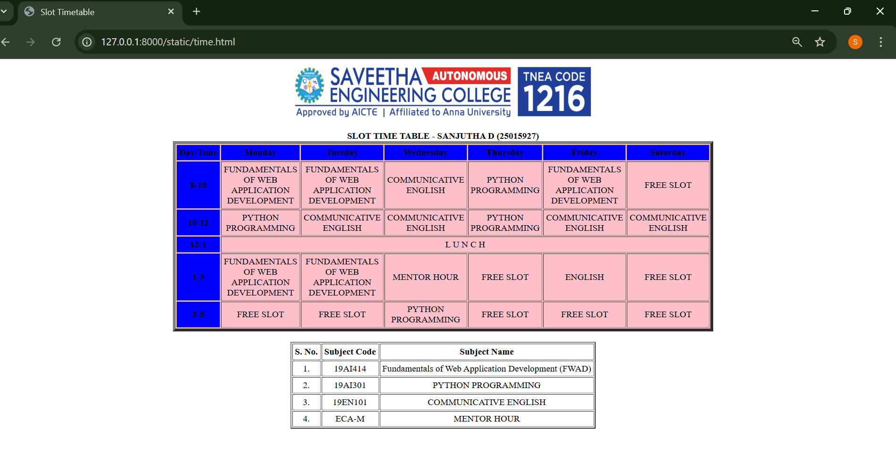

# Ex03 Time Table
## Date:18.09.25

## AIM
To write a html webpage page to display your slot timetable.

## ALGORITHM
### STEP 1
Create a Django-admin Interface.

### STEP 2
Create a static folder and inert HTML code.

### STEP 3
Create a simple table using ```<table>``` tag in html.

### STEP 4
Add header row using ```<th>``` tag.

### STEP 5
Add your timetable using ```<td>``` tag.

### STEP 6
Execute the program using runserver command.

## PROGRAM
```
<html>
<head>
  <title>Slot Timetable</title>
</head>
<body
  <center>
    
  </center>
  <br>
  <table align="center" width="540" cellspacing="2" cellpadding="4" border="5" bgcolor="pink">
    <caption><b>SLOT TIME TABLE - SANJUTHA D (25015927)</b></caption>
    <tr align="center">
      <th bgcolor="blue">Day/Time</th>
      <th bgcolor="blue">Monday</th>
      <th bgcolor="blue">Tuesday</th>
      <th bgcolor="blue">Wednesday</th>
      <th bgcolor="blue">Thursday</th>
      <th bgcolor="blue">Friday</th>
      <th bgcolor="blue">Saturday</th>

    </tr>

    <tr align="center">
      <th bgcolor="blue">8-10</th>
      <td>FUNDAMENTALS OF WEB APPLICATION DEVELOPMENT</td>
      <td>FUNDAMENTALS OF WEB APPLICATION DEVELOPMENT</td>
      <td>COMMUNICATIVE ENGLISH</td>
      <td>PYTHON PROGRAMMING</td>
      <td>FUNDAMENTALS OF WEB APPLICATION DEVELOPMENT</td>
      <td>FREE SLOT</td>
    </tr>

    <tr align="center">
      <th bgcolor="blue">10-12</th>
      <td>PYTHON PROGRAMMING</td>
      <td>COMMUNICATIVE ENGLISH</td>
      <td>COMMUNICATIVE ENGLISH</td>
      <td>PYTHON PROGRAMMING</td>
      <td>COMMUNICATIVE ENGLISH</td>
      <td>COMMUNICATIVE ENGLISH</td>
    </tr>
    <th bgcolor="blue">12-1</th>
    <td colspan="6" align="center">L U N C H</td>
    </tr>
    <tr align="center">
    <th bgcolor="blue">1-3</th>
    <td>FUNDAMENTALS OF WEB APPLICATION DEVELOPMENT</td>
    <td>FUNDAMENTALS OF WEB APPLICATION DEVELOPMENT</td>
    <td>MENTOR HOUR</td>
    <td>FREE SLOT</td>
    <td>ENGLISH</td>
    <td>FREE SLOT</td>
    </tr>

    <tr align="center">
    <th bgcolor="blue">3-5</th>
    <td>FREE SLOT</td>
    <td>FREE SLOT</td>
    <td>PYTHON PROGRAMMING</td>
    <td>FREE SLOT</td>
    <td>FREE SLOT</td>
    <td>FREE SLOT</td>
    </tr>
    </table>
    <br>

    <table align="center" cellspacing="2" cellpadding="4" border="2">
    <tr align="center">
        <th>S. No.</th>
        <th>Subject Code</th>
        <th>Subject Name</th>
    </tr>

    <tr align="center">
        <td>1.</td>
        <td>19AI414</td>
        <td>Fundamentals of Web Application Development (FWAD)</td>
    </tr>
    <tr align="center">
        <td>2.</td>
        <td>19AI301</td>
        <td>PYTHON PROGRAMMING</td>
    </tr>
    <tr align="center">
      <td>3.</td>
      <td>19EN101</td>
      <td>COMMUNICATIVE ENGLISH</td>
    </tr>
    <tr align="center">
      <td>4.</td>
      <td>ECA-M</td>
      <td>MENTOR HOUR</td>
    </tr>
  </table>
</body>
</html>

```

## OUTPUT


## RESULT
The program for creating slot timetable using basic HTML tags is executed successfully.
